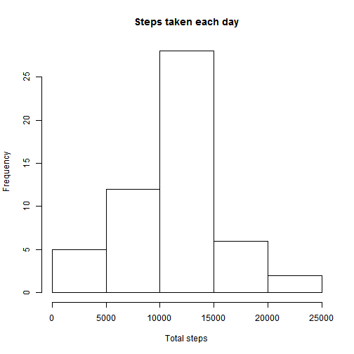
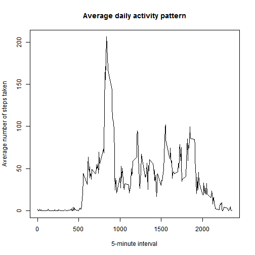
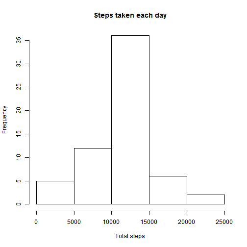
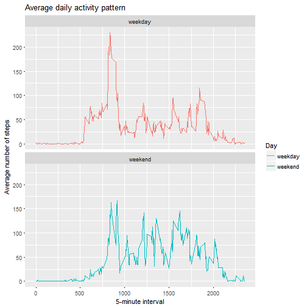

Reproducible research course project 1
======================================

1. Here is the code to load the dataset from the current working directory.


```r
temp <- tempfile()
download.file("https://d396qusza40orc.cloudfront.net/repdata%2Fdata%2Factivity.zip",temp)
unzip(temp, list = TRUE)
```

```
##           Name Length                Date
## 1 activity.csv 350829 2014-02-11 10:08:00
```

```r
data <- read.csv(unzip(temp,"activity.csv"))
unlink(temp)
```

The total number of steps taken each day is calculated as :


```r
h <- aggregate(steps ~ date, data, sum)
```

2. Making a histogram of steps taken each day :


```r
hist(h$steps, main = "Steps taken each day", xlab = "Total steps")
```



3. The mean and median of the total number of steps taken per day as calculated as follows :


```r
mean(h$steps)
```

```
## [1] 10766.19
```

```r
median(h$steps)
```

```
## [1] 10765
```

The mean of the total number of steps taken per day is 10766

The median of the total number of steps taken per day is 10765

4. Making a plot of the  5-minute interval (x-axis) and the average number of steps taken, averaged across all days (y-axis)


```r
## Calculate the average number of steps taken for 5 minute interval
intervalMean <- aggregate(steps ~ interval, data, mean)

plot(intervalMean$interval,intervalMean$steps, type = "l", xlab = "5-minute interval", ylab = "Average number of steps taken", main = "Average daily activity pattern")
```



5. The 5-minute interval, on average across all the days in the dataset, containing the maximum number of steps is calculated as follows :


```r
intervalMean[which.max(intervalMean$steps),]
```

```
##     interval    steps
## 104      835 206.1698
```

6. The total number of missing values in the dataset is calculated as : 

```r
s <- sum(is.na(data$steps))
s
```

```
## [1] 2304
```

The total number of missing values in the dataset is 2304

All the missing values in the dataset will be filled in with the mean for that 5-minute interval in the following code :


```r
## copy of the data is created
data1 <- data

## Replacing NAs with the mean value for that interval 
data1$steps <- ifelse(is.na(data1$steps) == TRUE, intervalMean$steps[intervalMean$interval %in% data1$interval], data1$steps)
```

To if all the NAs have been replaced in the new data set : 


```r
sum(is.na(data1$steps))
```

```
## [1] 0
```

7. Make a histogram of the total number of steps taken each day with the new dataset :

```r
## Total number of steps
h1 <- aggregate(steps ~ date, data1, sum)
## Making the histogram
hist(h1$steps, main = "Steps taken each day", xlab = "Total steps")
```




The mean and median of the total number of steps taken per day after imputing the data is calculated as follows :


```r
mean(h1$steps)
```

```
## [1] 10766.19
```

```r
median(h1$steps)
```

```
## [1] 10766.19
```

The mean of the total number of steps taken per day after imputing the data is 10766

The median of the total number of steps taken per day after imputing the data is 10766

Thus we see that there is no significant impact of imputing missing data on the estimates of the total daily number of steps.

Converting the date variable in the data set from factor to date type :

```r
data1$date <- as.Date(data1$date,format = "%Y-%m-%d")
```

Creating a new factor variable in the dataset with two levels - "weekday" and "weekend" indicating whether a given date is a weekday or weekend day.


```r
x <- c("Saturday","Sunday")
data1$Day <- ifelse(weekdays(data1$date) %in% x, "weekend", "weekday")
data1$Day <- as.factor(data1$Day)
str(data1)
```

```
## 'data.frame':	17568 obs. of  4 variables:
##  $ steps   : num  1.717 0.3396 0.1321 0.1509 0.0755 ...
##  $ date    : Date, format: "2012-10-01" "2012-10-01" ...
##  $ interval: int  0 5 10 15 20 25 30 35 40 45 ...
##  $ Day     : Factor w/ 2 levels "weekday","weekend": 1 1 1 1 1 1 1 1 1 1 ...
```

8. Making a panel plot containing a time series plot (i.e. type = "l") of the 5-minute interval (x-axis) and the average number of steps taken, averaged across all weekday days or weekend days (y-axis).


```r
intervalMeanByDay <- aggregate(steps ~ interval + Day, data1, mean)
library(ggplot2)
```

```
## Warning: package 'ggplot2' was built under R version 3.4.1
```

```r
ggplot(intervalMeanByDay, aes(x = interval, y = steps, color = Day)) + geom_line() + labs(title = "Average daily activity pattern", x = "5-minute interval", y = "Average number of steps") + facet_wrap(~Day, ncol = 1, nrow = 2) 
```




